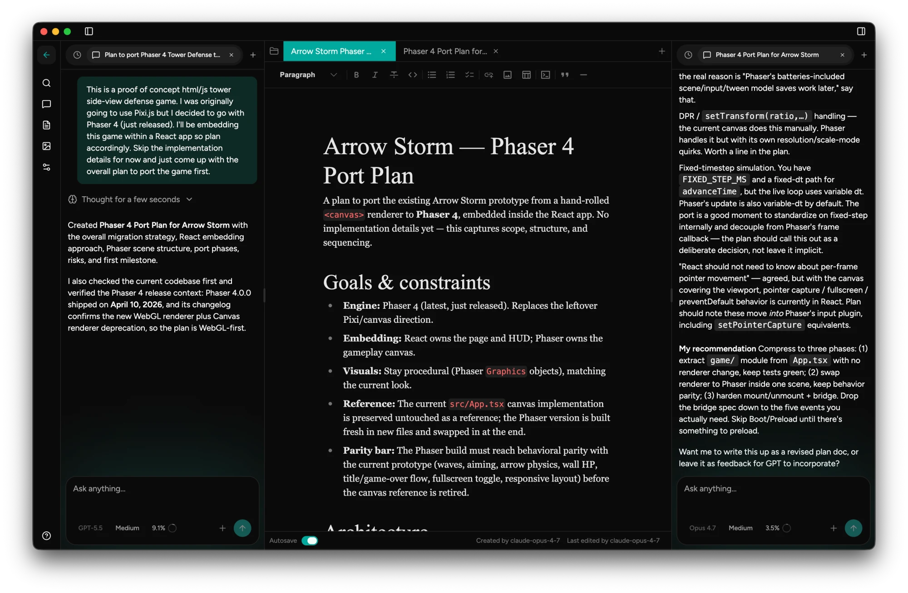

# Trident

**A desktop AI workspace where several models work side by side on the same
documents.**

[](LICENSE)

Trident runs two chat panels at once — Claude in one, GPT or Gemini in the other
— over a shared project of markdown documents and images. Ask one model to
draft, the other to critique, and let either one edit the document directly. It
is built for long-running work: dissertations, research projects, books,
specifications, course material.

Your workspace is stored on your machine. Trident has no accounts and no servers
of its own. Requests send the content needed for each task directly to your
configured AI provider; credentials are encrypted locally using the operating
system's secure storage.



→ [tridenthq.app](https://tridenthq.app)

## Download

Signed, notarized builds for **Apple Silicon Macs** are published at
[eastechs/trident-releases](https://github.com/eastechs/trident-releases/releases).
Once installed, the app updates itself from there.

Windows and Linux targets are configured but not currently built or tested. If
you want them, open an issue — it is a question of testing capacity rather than
architecture.

## What it does

- **Two models, one workspace.** Independent conversations side by side, each
  with its own model and reasoning-effort setting.
- **Shared documents.** A markdown editor with tabs and autosave. Models can
  read, search, and edit the same documents you are editing, and everything is
  mirrored to plain `.md` files under `~/Trident/` that you can open in any
  other editor.
- **Semantic search.** Documents and images are chunked and embedded, so you can
  search a project by meaning rather than keyword.
- **Image generation** and a gallery with per-image metadata.
- **Live cost tracking.** Per-turn spend including cache reads and writes,
  priced from a continuously refreshed rate table.

## AI providers

Trident chats through two kinds of connection, both configured in
**Settings → Providers**:

- **Direct APIs** — Anthropic, OpenAI, and Google Gemini, each with a provider
  API key.
- **Cloud platforms** — Amazon Bedrock, Google Vertex AI, and Azure OpenAI,
  using the models and deployments already available in your organization's own
  account.

Credentials are encrypted locally using Electron's `safeStorage` and kept out
of the renderer. The main process uses API keys or derived authentication tokens
to authenticate with the configured provider and its identity services.
Non-secret details like regions, endpoints, and model IDs are plain settings.

## Privacy and network behavior

Trident is local-first, and that claim is checkable — which is much of the
reason this source is public.

**There is no telemetry, no analytics, and no account system.** Projects,
documents, images, and conversations are stored in an embedded Postgres database
in your user data directory, plus plain files under `~/Trident/`.

Chat and image requests send prompts, conversation context, and any documents
or images included in the request to the selected provider. Provider-side
processing and retention are governed by your provider account and its terms.

**Semantic indexing uses OpenAI.** With an OpenAI key configured and semantic
indexing enabled for a project, saving or editing documents sends their text
chunks to OpenAI for embeddings. Image indexing sends image names and generation
prompts. This is independent of the chat provider selected in either panel.
Disabling semantic indexing stops new automatic document and image indexing;
requests already in progress may finish. Semantic searches separately send the
search query to OpenAI, including searches over an existing index.

Background requests include:

| Destination | Purpose | Application data |
| --- | --- | --- |
| GitHub Releases and its download hosts | Update checks on launch and every 4 hours; downloading updates | Release metadata and installer requests; no workspace content or provider credentials |
| `raw.githubusercontent.com` | Refreshing the model pricing table | No workspace content or provider credentials |
| `models.dev` | Provider logos in the model picker | The requested provider logo; no workspace content or provider credentials |

These services receive ordinary network metadata such as your IP address and
request headers. The updater also sends a locally generated, persistent
installation ID (`x-user-staging-id`) with release metadata requests to support
staged rollouts. Remote images
embedded in documents or model responses may also contact their hosts; opening
external links uses your default browser. Provider connections may contact
authentication and model-discovery endpoints in addition to inference endpoints.

Requests to AI providers go directly from your machine to that provider using
your key. Trident operates no proxy and no gateway, so there is no point at
which your prompts pass through infrastructure controlled by Eastechs.

## Build from source

Requires Node 24+ (see `.nvmrc`).

The v0.5.0 macOS app requires macOS 13 Ventura or later. Official builds target
Apple Silicon (arm64).

```bash
npm ci
npm run dev
```

That starts Vite, tsup, and Electron together with hot reload.

| Script | Purpose |
| --- | --- |
| `npm run build` | Build main (tsup) + renderer (vite) into `dist/` |
| `npm run dist:mac` | Build, then package a macOS dmg/zip via electron-builder |
| `npm run lint:check` / `npm run lint` | ESLint (check / autofix) |
| `npm run format:check` / `npm run format` | Prettier (check / write) |
| `npm run types:check` | `tsc --noEmit` |
| `npm run test:provider-contracts` | Model reference, capability, and pricing contracts |
| `npm run test:image-providers` | Image generation request contracts |
| `npm run test:desktop-contracts` | Preload, authentication, window, credential, and updater contracts |
| `npm run notices` | Generate bundled licenses and dependency notices from the installed lockfile |
| `npm run release` | Cut a release (maintainer only, see below) |

`npm run build` and `npm run dev` do not need signing credentials. The macOS
distribution scripts require the signing and notarization setup described below.

Architecture in one paragraph: the Electron main process boots an Express server
on `127.0.0.1:19274`, guarded by a per-launch shared secret, and serves the
React renderer. Data lives in PGLite (Postgres compiled to WebAssembly) with
pgvector for embeddings, accessed through Drizzle. AI calls go through the
Vercel AI SDK, with provider resolution in `src/main/ai/providers.ts`.
[CONTRIBUTING.md](CONTRIBUTING.md) has a fuller map.

## Releases and auto-update

The packaged app self-updates via
[`electron-updater`](https://www.electron.build/auto-update). On launch, and
every 4 hours, it checks GitHub Releases, downloads a newer version in the
background, and surfaces an **Install available** indicator in the left sidebar;
clicking it installs and restarts.

Built installers are published to a separate public repository,
[eastechs/trident-releases](https://github.com/eastechs/trident-releases),
configured as the `github` publish provider in `electron-builder.yml`. Keeping
binaries out of the source repository keeps clones small, and every installed
app already points at that update feed. No credential ships inside the app —
clients read updates anonymously.

> Auto-update currently targets **macOS arm64** only, matching the signed
> dmg/zip that gets built.

### Cutting a release (maintainer)

Requires signing and upload credentials in the environment:

| Var | Purpose |
| --- | --- |
| `GH_TOKEN` | Uploads the GitHub release. `export GH_TOKEN=$(gh auth token)` |
| `APPLE_ID`, `APPLE_APP_SPECIFIC_PASSWORD`, `APPLE_TEAM_ID` | Notarization |

Run the checks in [CONTRIBUTING.md](CONTRIBUTING.md), then, from a clean `main`:

```bash
npm version <patch|minor|major>
npm run release
```

This builds, notarizes, and uploads the dmg, zip, `latest-mac.yml`, and blockmap
to a **draft** release, then pushes the version tag. Release notes link to the
matching source tag and source archive. Drafts are invisible to the updater until
published by hand.

## License

Trident is free software under the
[GNU Affero General Public License v3.0](LICENSE). You may use, study, modify,
and redistribute it. If you distribute a modified version — or run one as a
network service — that version must also be AGPL.

**If the AGPL does not work for your organization**, commercial licenses and
support agreements are available: <licensing@eastechs.com>. Universities and
research groups are welcome to get in touch as well; there is usually a sensible
arrangement.

The Trident name and icon are not covered by the AGPL. Forks are welcome and
should use their own branding — see [TRADEMARK.md](TRADEMARK.md). Third-party
attribution is in [CREDITS.md](CREDITS.md).

## Contributing

External code contributions are currently closed, but we plan to welcome them
in the near future. Bug reports and feature requests are welcome.

Pull requests are disabled for now. See [CONTRIBUTING.md](CONTRIBUTING.md) for
feedback channels and instructions for building your own copy.

Security issues should be reported privately: [SECURITY.md](SECURITY.md).

---

Built by Eastechs, LLC.
